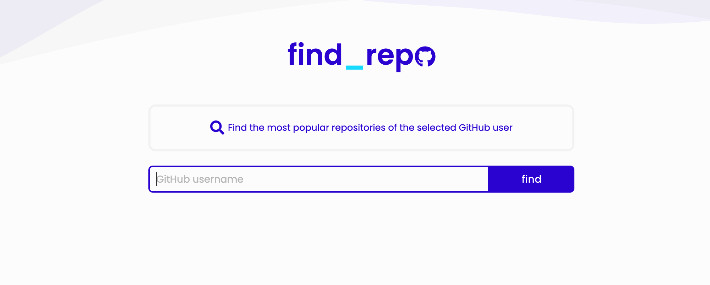
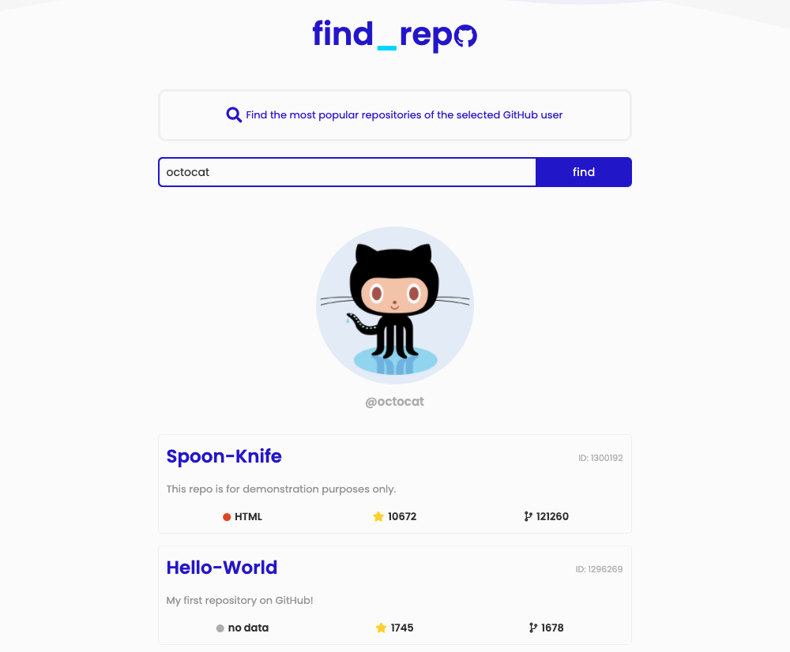

# GitHub Repositories Search

## :technologist: Technologies and metodologies

Technologies and metodologies used in this project:

**HTML / CSS / BEM / RWD / JavaScript /
Fetch / GitHub API / Webpack**

#### :clapper: Check live version: **[LIVE](https://rafalkazik.github.io/github-repo-search/)**

## :gear: Installation

The project uses [node](https://nodejs.org/en/) and [npm](https://www.npmjs.com/). To run the app on your device you should install all dependencies. Then create a localhost port and run your web explorer.

Let's start with installing all dependencies. Move to the app main workspace and run:

    npm i

To create a localhost port you should type:

    npm start

Our repositories search engine is ready at port 8080.

    http://localhost:8080/

## :microscope: How it works?

### Find github user repositories! :mag:

- enter the username whose repositories you want to see,
- if you enter an incorrect username or you leave empty input - the page will refresh.

### :star: See the most popular repositories! :star:

- after searching, you will see the most popular repositories of the user with the highest number of :star:

## :mailbox: Feel free to contact me

You can find me on **[LINKEDIN](https://www.linkedin.com/in/rafa%C5%82-kazik-924b8710a/)**
